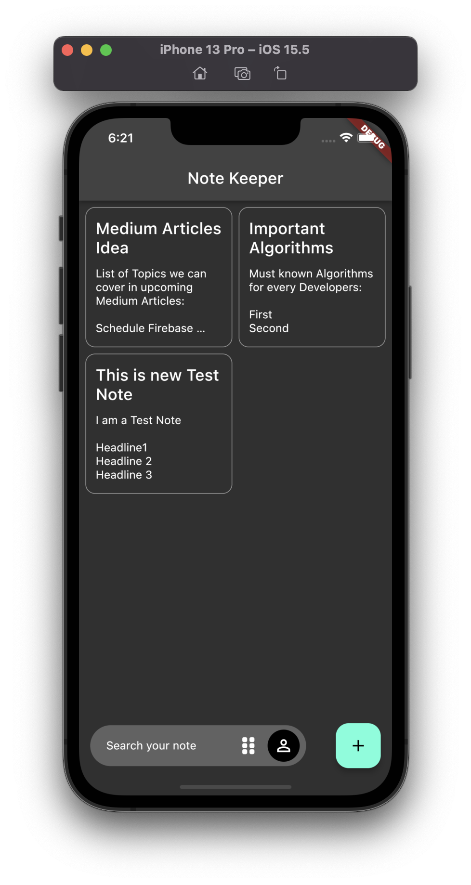
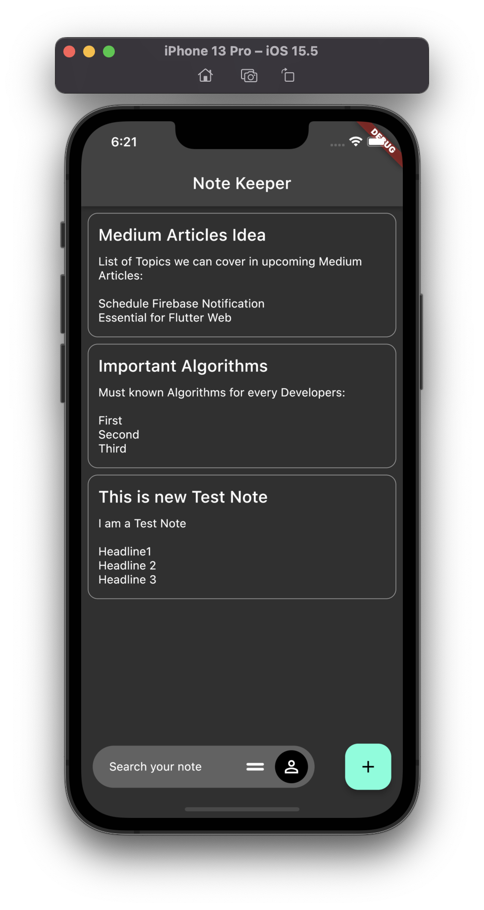
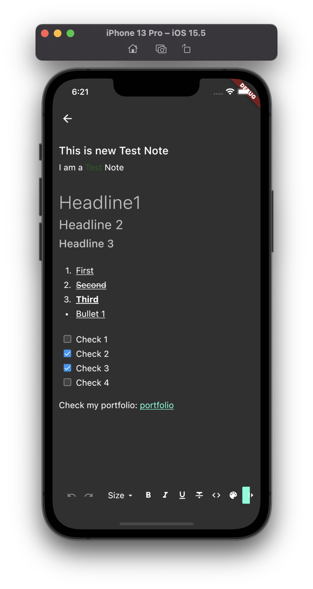
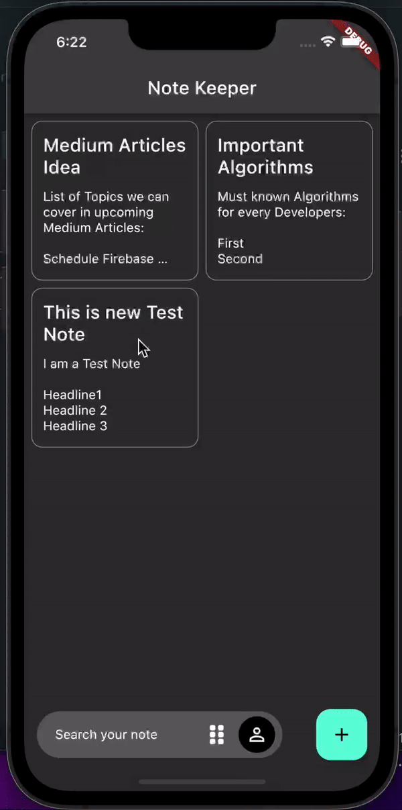
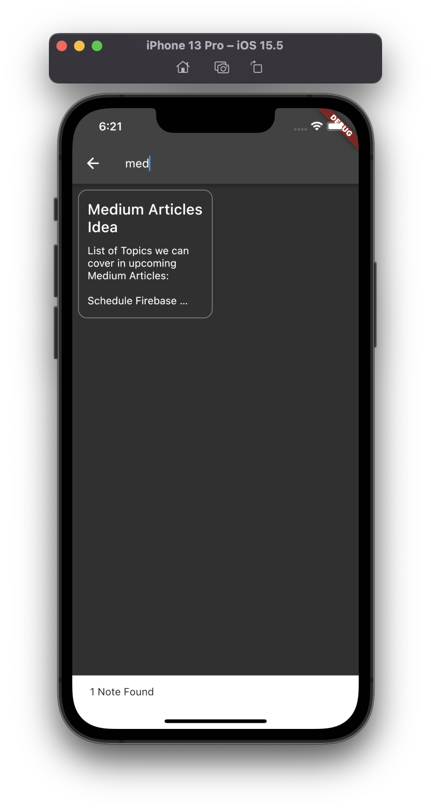
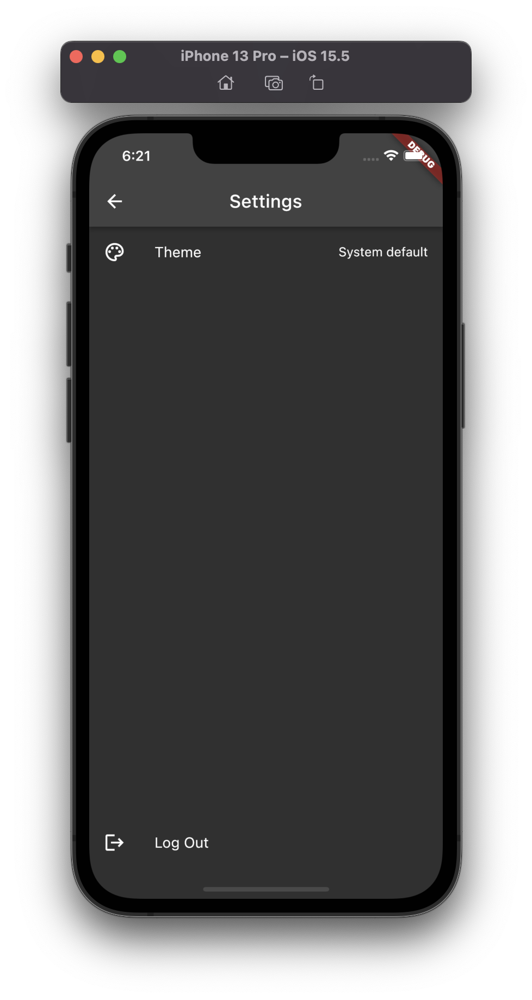

# Note Keeper

A [Flutter](https://flutter.dev) + [AppWrite](https://appwrite.io) Project

**Note Keeper** is a Note Creater App build with Flutter backed by AppWrite (An Open-Source Backend Server)

## 💡 Functionalities

- [x] Login and Register with Email and Password
- [x] Create Note
- [x] Edit Note
- [x] Delete Created Note
- [x] Search Note

## 🎬 Preview

### Home




### Note



### Delete



### Search



### Setting



## 🚀 Installation

### ❤️ AppWrite

To run AppWrite Backend locally

- Install [Docker](https://docs.docker.com/engine/install/)
- Add `appwrite/docker-compise.yml` in your Docker Client

### 💙 Flutter

To run Flutter App locally

- Install [Flutter](https://docs.flutter.dev/get-started/install)
- Navigate to `frontend/`
- Run `flutter pub get`

## 🔧 Configuration

To Run this Application locally on your Machine.

- Make sure AppWrite and Flutter is Installed
- Navigate to `frontend/`
- Create a file name `.env`
- Add Following:

  ```
  APPWRITE_ENDPOINT=http://localhost/v1
  APPWRITE_PROJECT_ID=62b6948239cd28246c64
  ```

  Update the values as per your appwrite client.

## 📦 Packages

Following packages are being used in this flutter app:

| package                                                                             | useage                                                         |
| ----------------------------------------------------------------------------------- | -------------------------------------------------------------- |
| [appwrite](https://pub.dev/packages/appwrite)                                       | Official flutter package to use AppWrite                       |
| [dartz](https://pub.dev/packages/dartz)                                             | Functional programming in Dart                                 |
| [equatable](https://pub.dev/packages/equatable)                                     | To make comparsion of Model easy                               |
| [flutter_dotenv](https://pub.dev/packages/flutter_dotenv)                           | Load configuration at runtime from a .env                      |
| [flutter_quill](https://pub.dev/packages/flutter_quill)                             | Rich text editor                                               |
| [flutter_riverpod](https://pub.dev/packages/flutter_riverpod)                       | State management library                                       |
| [flutter_staggered_grid_view](https://pub.dev/packages/flutter_staggered_grid_view) | Provides a collection of Flutter grids layouts                 |
| [logging](https://pub.dev/packages/logging)                                         | Create readable logs                                           |
| [routemaster](https://pub.dev/packages/routemaster)                                 | Easy-to-use router for Flutter, which wraps over Navigator 2.0 |

## 👨‍💻 Contributor

### Made by [Tekeshwar Singh](https://github.com/tsvillain)

[](https://www.linkedin.com/in/tsvillain/)
[](https://www.github.com/tsvillain/)
[](https://www.twitter.com/tsvillain/)
[](https://www.instagram.com/tsvillain/)
[](https://play.google.com/store/apps/developer?id=Tekeshwar+Singh&hl=en_US&gl=US)
